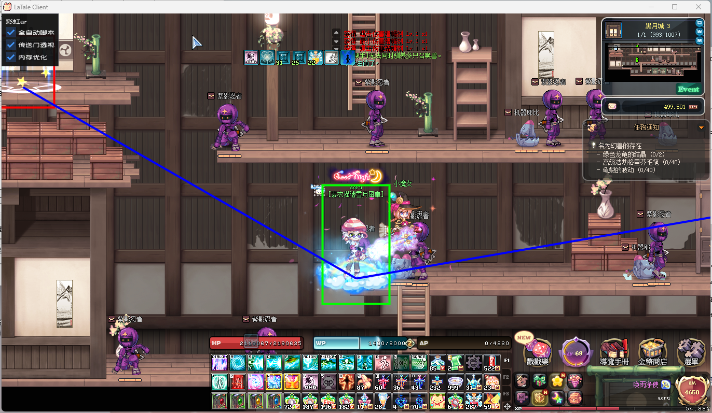

# chd_location_draw
A cpp program for drawing chd game portal and object.

## Build
```
mkdir build
cmake ..
make
```
will generate .dll file and .exe injection file.
## Run
Run the game and click 'inject.exe'.
Just enjoy it.
## Blog
https://www.cnblogs.com/aoru45/p/16810996.html